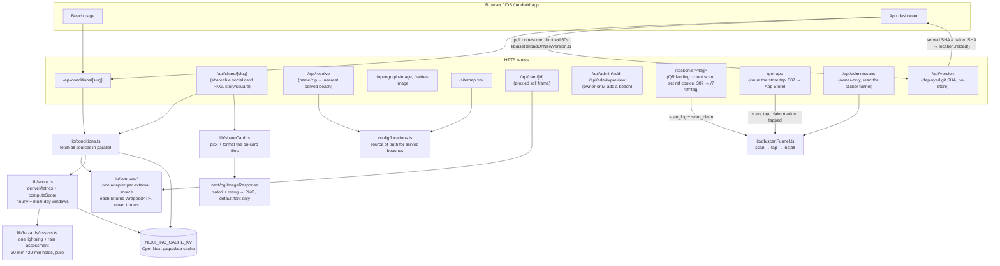
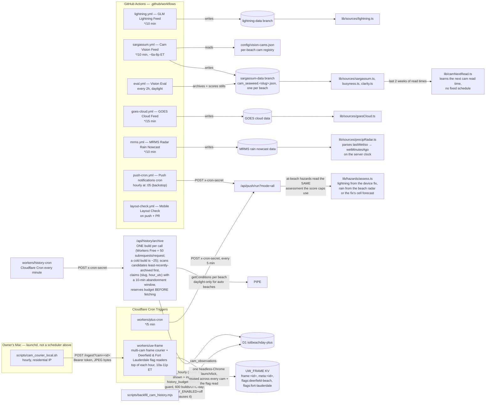

# Backend architecture — Is It Beach Day

This map shows every backend part and how it connects: the request path a
page or the app takes, the scheduled jobs that keep data fresh, and the Beach
Day Plus alert pipeline. Update this file in the same commit as any change
that adds, removes, or rewires a part.

Hosting: **Cloudflare Workers**, built with OpenNext (`npm run deploy`). See
`docs/HANDOFF.md` for the deploy command and owner to-dos.

## 1. Request path — a page or app call

Every beach page and the app both go through the same conditions pipeline.
The pipeline fetches ~18 external sources in parallel, derives metrics, and
scores the result; the response is cached so a burst of visitors doesn't
re-run all of that per request.

On the Plus side, the app also calls the device/presence routes directly
(see diagram 3).

## 2. Scheduled jobs — keeping the feeds current

Two kinds of scheduler: **GitHub Actions** (free compute, runs scripts, writes
to data branches or calls the app) and **Cloudflare Cron Triggers** (run
inside a Worker, call the app's own API).

**`workers/uw-frame` is a multi-cam courier, not a single grab.** Deerfield
Beach's cams (underwater, crowd/sand, surf, pier) plus Fort Lauderdale
Beach's Elbo Room cam (crowd/sand, owner approved) exist only as YouTube live
streams — there's no still-image feed — so each cron tick opens ONE headless
Chrome and reuses the SAME page across every camera due that tick (navigate
the embed, wait for it to actually be playing, screenshot, move to the next
cam) rather than launching a browser per camera. The same browser also loads
the City's public ArcGIS "Beach Conditions" dashboard once per daylight tick
to read which lifeguard flag(s) are currently flying — that dashboard shows
the active flag(s) by toggling block visibility rather than changing text, so
the reader records which of the five known blocks is actually visible. The
underwater cam still grabs hourly (unchanged); the three surface cams grab
every 3 hours in daylight only, and the flag read runs every daylight tick —
all three cadences, and the full per-day Browser Rendering time budget, are
decided in `workers/uw-frame/src/lib/schedule.ts` and documented in
`workers/uw-frame/src/index.ts`. Endpoints: `GET /frame[?cam=<id>]`,
`GET /meta[?cam=<id>]` (no `cam` = the underwater cam, unchanged legacy
keys), `GET /cams` (registry + each cam's last grab), and
`GET /flags?slug=deerfield-beach`, `GET /flags?slug=fort-lauderdale`.

**Fort Lauderdale lifeguard flags.** The City of Fort Lauderdale Fire Rescue posts a plain-text "Beach Conditions" page once a day (flags, sea-pest notes, ocean conditions, water temperature). A plain fetch gets a 403 bot-block, so `uw-frame` opens it in Browser Rendering on the same daylight-gated tick as the Deerfield read, reads `document.body.innerText`, parses it with the pure section parser `workers/uw-frame/src/lib/ftlConditions.ts`, and stores `flags:fort-lauderdale` in the same `{flags, observedAtUtc, ok}` shape `lib/sources/cityOfficial.ts`'s `mapFlagsFeed` expects, plus `pageDate`, `seaPests`, `seaPestsPresent`, `waterTempF`, `oceanConditions`. Because the City posts daily, a page more than 2 calendar days old (America/New_York) is written `ok:false`, which the app shows as "unknown" rather than a stale flag. A failed or stale read never overwrites a good stored one (the attempt lands under `flags-attempt:fort-lauderdale`). `seaPests` is captured but not yet shown in the UI.

As of September 2026, frames arrive from the owner's Mac courier
(`scripts/cam_courier_local.sh`, hourly, residential IP) via `POST /ingest`;
the Worker's own headless-Chrome grab remains as a fallback. YouTube now
blocks video playback from Cloudflare's browser fleet, so the Mac — a normal
home connection — grabs each frame and sends it to the Worker instead. Both
paths write through the same guard, so neither can overwrite the other's
newer good frame; `GET /cams` shows which path supplied each camera's
current frame in its `source` field ("courier" or "browser").

`push-cron.yml` and `plus-cron` both hit the same route — GitHub's schedule is
best-effort, so the Cloudflare cron is the reliable path and GitHub is the
backstop. `PUSH_SAFETY_ALERTS` (a Worker var) kills every hazard alert
app-wide without a deploy.

**Cam vision is per-beach.** `sargassum.yml` no longer reads one hard-coded
Boca cam list: `scripts/cam_seaweed.py` loads `config/vision-cams.json` (one
entry per beach, each with its own cams and a `kind` of `feed`,
`direct`, or `hls`) and processes every registered beach in the same run,
publishing one `cam_seaweed.<slug>.json` per beach to `sargassum-data`. A
`vitest` (`lib/visionCams.test.ts`) cross-checks the registry against
`config/locations.ts` so the two never drift apart. `lib/sources/camFeed.ts`
builds each beach's feed URL from `loc.slug`; `sargassum.ts` and `busyness.ts`
both use it, and Boca Raton alone falls back to the pre-split single-file
`cam_seaweed.json` (which the job still publishes as a copy, for one release)
if its own per-beach file isn't there yet. The underwater "Spinner the Sea
Cam" read stays a single per-run calibration signal — the same `uw` value is
copied onto every beach's file, not read once per beach.

## 3. Beach Day Plus — device, presence, and alerts

```mermaid
flowchart TD
  subgraph app [App]
    OPEN[Open / foreground] -->|deviceId, profile, prefs| DEV["/api/devices<br/>POST upsert · GET read"]
    OPEN -->|fix: lat, lon, accuracy| PRES["/api/presence<br/>POST arm · DELETE disarm"]
    TRIAL["/api/devices/trial<br/>3-day trial, once (fallback when billing is off)"]
    UNLOCK["/api/devices/unlock<br/>code → 365-day plan"]
    BUY["/api/devices/purchase<br/>after a store purchase or Restore"]
    REG["/api/push/register-native<br/>/api/push/unregister-native"]
    HAZ2["/api/hazards<br/>POST — native-only, rate-limited<br/>'where you stand' lightning + rain"]
    LAREG["/api/live-activity/register<br/>POST — native-only, rate-limited<br/>start/rotate a Beach Session token"]
    LAEND["/api/live-activity/end<br/>POST — native-only, rate-limited<br/>Off / dismiss"]
  end

  APPSTORE[(App Store<br/>monthly · yearly, 3-day trial)] -->|"purchase via RevenueCat SDK<br/>appUserID = deviceId"| BUY
  BUY -->|"GET /v1/subscribers/{deviceId}<br/>secret key"| RC[(RevenueCat)]
  RC -->|"webhook: any event with a mappable device id<br/>Authorization = REVENUECAT_WEBHOOK_SECRET"| RCHOOK["/api/revenuecat/webhook"]
  RCHOOK -->|"reconcile: GET /v1/subscribers/{deviceId}<br/>same secret key — never trusts the event's own meaning"| RC

  DEV --> STORE[lib/db/store.ts<br/>one DeviceStore interface]
  PRES --> STORE
  TRIAL -->|claimTrial: trialUntil, once, atomically| STORE
  UNLOCK -->|codeUntil| STORE
  BUY -->|storeUntil, up only| STORE
  RCHOOK -->|storeUntil, from RC's live answer| STORE
  REG --> STORE

  STORE -->|production| D1[(D1: isitbeachday-plus<br/>devices · presence · alert_log · send_claims<br/>scan_log · scan_tap · scan_claim · install_attrib<br/>live_activities)]
  LAREG -->|"entitled + armed at slug (listArmed gate)<br/>one active session/device, token rotation"| STORE
  LAEND -->|markLiveActivityEnded 'user'| STORE
  STICKER -->|"count scan (bot-filtered), fail-soft"| D1
  GETAPP -->|"count store tap, fail-soft"| D1
  DEV -->|"after the upsert: credit a fresh native install<br/>to a recent scan on the same network (probable)"| ATTRIB[lib/db/scanFunnel.ts<br/>attributeInstall]
  REG --> ATTRIB
  ATTRIB --> D1
  ADMINSCANS -->|read the funnel| D1
  STORE -->|tests, next dev w/o bindings| MEM[(memory store<br/>.plus-store.json fallback)]

  KVLEGACY[(PUSH_KV<br/>legacy push-token subs)] -.imported once per device.-> STORE

  HAZ2 -->|"per fix"| STRIKES
  HAZ2 -->|"per fix or beach radar"| RAIN
  HAZ2 -->|"beach's own cached pair"| PIPE2
  HAZ2 -->|"assessLightning/assessRain"| HAZASSESS[lib/hazards/assess.ts<br/>one lightning + rain assessment<br/>30-min / 20-min holds, pure]

  RUN["/api/push/run?mode=all"] --> ATBEACH[lib/alerts/run.ts<br/>runAtBeachAlerts]
  RUN --> MORNING[lib/alerts/morning.ts<br/>personal digest + Excellent alert]

  ATBEACH -->|listArmed: entitled + live fix| D1
  ATBEACH -->|per fix| STRIKES[lib/sources/lightning.ts<br/>summarizeStrikes]
  ATBEACH -->|per beach, memoized| PIPE2[lib/conditions.ts]
  ATBEACH -->|per fix or cell| RAIN[lib/alerts/rain.ts<br/>MRMS radar or Open-Meteo 15-min]
  ATBEACH --> EVALRULES[lib/alerts/evaluate.ts<br/>pure alert rules]
  EVALRULES --> DEDUP[lib/alerts/dedup.ts<br/>30-min repeat window, D1 alert_log]

  MORNING -->|entitled only, 08:00 the BEACH's local time| PIPE2

  DEDUP --> CLAIM[lib/db/sendClaims.ts<br/>atomic send claim, D1 send_claims]
  MORNING --> CLAIM
  CLAIM --> SEND[lib/push/apns.ts, fcm.ts<br/>deliver]
  SEND -->|APNs| APNS[(Apple Push Notification service)]
  SEND -->|FCM| FCM[(Firebase Cloud Messaging)]

  %% Beach Session Live Activity (docs/LIVE_ACTIVITY_PLAN.md Phase 3) — one
  %% evaluation, two independent fan-outs from the SAME armed-session loop.
  ATBEACH -->|"listActiveLiveActivities + due-end sweep<br/>(expired presence or expires_at)"| D1
  ATBEACH -->|"per activity: contentStateFromConditions<br/>(fed the ONE lightning assessment evaluateAtBeach already computed<br/>— no second assessLightning call)"| LASTATE[lib/liveActivity/state.ts<br/>contentStateFromConditions, hashContentState]
  LASTATE --> LADECIDE[lib/liveActivity/server/decide.ts<br/>lightning-escalate / hash-change+60s / 15-min heartbeat]
  LADECIDE --> CLAIM
  CLAIM --> LASEND["lib/push/apns.ts<br/>sendLiveActivityUpdate<br/>apns-push-type: liveactivity"]
  LASEND -->|APNs| APNS
```

**Grant-source model.** `devices` keeps three independent expiries —
`store_until` (a purchase, mirrored from RevenueCat), `code_until` (an
unlock code), `trial_until` (the free trial) — instead of one shared
`plan`/`entitlement_until`. Effective access is the LATEST of the three, and
`plan`/`entitlement_until` are recomputed from them on every write, so a
route can only ever move ITS OWN grant, never overwrite someone else's: a
30-day Restore can't shorten a 365-day code, and a store refund clears only
`store_until`, leaving a code or trial grant standing. Every write goes
through one atomic SQL statement (`d1Store.ts`) so a concurrent purchase and
a concurrent preference save can never clobber each other, and the trial's
"grant it exactly once" check is a single conditional `UPDATE … WHERE
trial_used = 0` rather than a separate read then write.

**Webhook reconciliation.** The webhook does not apply an event's own
meaning (a RENEWAL retried late, after a newer EXPIRATION, used to be able to
silently restore access RevenueCat had already ended). Instead, any event
naming one of our devices makes the route ask RevenueCat's live subscriber
record "is `plus` active right now, and until when" and writes that answer
onto `store_until`. Delivery order and repeated deliveries stop mattering —
the write reflects the truth at request time either way.

**Note on KV namespaces:** `PUSH_KV` (legacy push subscriptions) and
`NEXT_INC_CACHE_KV` (the OpenNext page/data cache) are bound to the **same
underlying KV namespace id** in `wrangler.jsonc` — OpenNext prefixes its keys,
so they don't collide, but it means one namespace serves two unrelated jobs.
Worth splitting if either one grows enough to matter.

**Install token identity (`devices.token_hash`/`token_used_at`,
migrations/0008_device_tokens.sql).** `POST /api/devices` mints a 32-byte
install token the first time it sees a device row with no `token_hash` yet
(first minter wins), returns it once as `installToken`, and stores only its
sha256 hash. `/api/live-activity/register`, `/end`, and `/api/hazards`
require a matching `x-install-token` header once a device has a hash on file
(401 `no-token`), or `token-required` when it doesn't yet; every check goes
through the shared `lib/db/installTokenAuth.ts` `requireInstallToken`, which
also stamps `token_used_at` (once, on the first successful check for a
token — kept for cheap diagnostics only; nothing gates on it). See that
file's THREAT MODEL comment for the full model.

**No server-side token recovery.** There is deliberately no route to
recover a lost install token. A device that loses its token after it has
already been used (reinstall, cleared storage) reads back `no-token` and the
client (`lib/plus/client.ts` `ensureInstallToken`/`bootstrapInstallToken`)
degrades to a plain "not available" state for Live Activity / Where-you-
stand — nothing else (Plus alerts, presence, prefs) depends on this token.
On a `no-token` 401 from `/api/hazards`, the client clears its cached token,
retries the `POST /api/devices` bootstrap once (which answers with no token
since the hash already exists), and latches "not available" for the rest of
the session if nothing new arrives — it does not keep hammering the server.
A reinstall gets a fresh deviceId, and RevenueCat restore-purchases (keyed
off the store account, not deviceId) carries the Plus entitlement back
without the old token. App Attest (device-bound auth) is the planned
upgrade — see `docs/BUILD_PLAN.md`'s Later section.

**Live Activity register: rotation + one-active-per-device.** The native
plugin sends a monotonic `rotation` counter with each token; `registerLiveActivity`
(`lib/db/d1Store.ts`) only replaces a row's token when the incoming rotation
exceeds the stored `token_rotation`, and supersedes any other active row for
the same device in the same D1 batch — a device can never be observed
holding two 'active' rows, and an `activityId` can never change device
ownership. `expires_at` is recomputed every fan-out pass and on rotation from
the CURRENT presence/entitlement, capped at the row's own original
`started_at + 8h` (never extended by a rotation).

**Bounded Live Activity fan-out (`LA_MAX_PER_RUN`/`LA_MAX_ENDS_PER_RUN`,
default 10 each).** `ATBEACH` only sends updates for the `LA_MAX_PER_RUN`
activities least recently considered (`next_send_at` ascending) and ends at
most `LA_MAX_ENDS_PER_RUN` due rows per run, so one run's worst case stays
well inside the Workers Free 50-subrequest cap regardless of how many
sessions are armed at once; anything left over rolls to the next tick.
Every push (update or end) carries `v`/`seq` (a per-activity monotonic
counter, `last_seq`) so the phone can tell a stale/reordered push from the
current one, and an end push also sets `ended: true`. `lib/push/apns.ts`
keeps a separate HTTP/2 client per APNs environment and routes each row by
its own `apns_environment`, never by this server's own `APNS_PRODUCTION`.

**Beach-local scheduling:** the morning digest, "just turned Excellent", and
every hazard's freshness window are all judged in the **beach's own
timezone** (`config/locations.ts`'s `timezone`), never the phone's — a device
sees its home beach's 8 AM digest whatever zone the phone itself is in. The
phone's zone still rides along on the device row (`tz`), but only for
display; nothing in the sender schedules off it.

**Atomic send claims (`send_claims`, migrations/0004_send_claims.sql):** the
Cloudflare cron (every 5 min) and the GitHub Actions backstop (hourly) both
call `/api/push/run`, and can start within seconds of each other — both
enabled on purpose, since GitHub's schedule is best-effort. Two overlapping
runs can each read "not yet sent" from `alert_log` before either has written
its mark. Before sending any morning digest, Excellent alert, or at-beach
hazard, the sender claims `<deviceId>:<alertKey>:<window>` with an atomic
INSERT — only the run that wins the claim may send, so the 30-minute (or
once-a-day) dedup window still holds even when two runs race for it. A claim
whose send never finished (a crash, a timeout) is abandoned after 10 minutes
and may be re-claimed.

**The sticker funnel (`lib/db/scanFunnel.ts`, migrations/0005_scan_funnel.sql):**
three steps, each weaker evidence than the one before it. `/sticker` counts the
scan (`scan_log`) and leaves a short-lived note that someone on this network
scanned (`scan_claim`). `/get-app` counts the tap on "Get the app"
(`scan_tap`) and upgrades that note to "tapped through" — the last step we can
actually observe. Then, right after a device upsert, `/api/devices` and
`/api/push/register-native` (whichever the fresh install writes to first) credit
the install (`install_attrib`) if and only if the device row is minutes old,
native rather than web, and its network has an unspent note from the last six
hours. An install that never writes anything — no home beach, no profile, no
alerts — has no device row to credit, so it is invisible here exactly as it is
already missing from the device count.

That last step is a **match, not a fact** — Apple never says who installed the
app — so two phones on one home Wi-Fi can look like one scanner, and the growth
report always calls these installs *probable*. What we keep about a network is a
salted, truncated hash of the IP and nothing else, swept once the six-hour
window has passed. `/api/admin/scans` reads the whole chain in two queries.

## External integrations

| Source | Used for |
|---|---|
| RevenueCat | Beach Day Plus billing: the app buys through its SDK; the server confirms with its REST API (`/api/devices/purchase`), and `/api/revenuecat/webhook` re-asks that same REST API for the live subscriber state on any renewal/expiration/pause/cancellation ping rather than trusting the event itself (see docs/BILLING_SETUP.md) |
| Open-Meteo | Forecast, hourly forecast, nowcast, minutely rain (Plus alert fallback) |
| National Weather Service (NWS) | Alerts, forecast |
| NOAA CO-OPS | Tide predictions and real water level |
| NDBC | Buoy observations (waves, water temp) |
| MET Norway | Secondary forecast model (consensus) |
| EPA AirNow / CAMS | Air quality |
| NOAA S3 (GOES, GLM, MRMS) | Cloud cover, lightning strikes, radar rain nowcast |
| Gemini / Groq / OpenRouter / GitHub Models | Beach-cam vision reads (seaweed, busyness, water clarity) |
| iNaturalist | Portuguese man-o'-war sighting reports |
| FL Healthy Beaches | Water-quality advisories |
| video-monitoring.com | Public beach cam still frames |
| YouTube | Deerfield Beach underwater + surface cam sources, and Fort Lauderdale Beach's Elbo Room cam, live-embed only (`workers/uw-frame`) |
| ArcGIS (City of Deerfield Beach dashboard) | Lifeguard flag status read (`workers/uw-frame`) |
| City of Fort Lauderdale Fire Rescue "Beach Conditions" page | Lifeguard flags, sea pests, ocean report (`workers/uw-frame`, Browser Rendering) |
| Apple Push Notification service (APNs) | iOS push delivery |
| Firebase Cloud Messaging (FCM) | Android push delivery |

**Alert evaluation after the 2026-09 location audit (LOC-01, LOC-08, LOC-09).**
`evaluateAtBeach` judges every snapshot hazard independently (severe warnings,
Beach Hazards Statement, thunder, water advisory, rip, flag) and only replaces
the centroid *lightning* rung with the device-fix read; preferences apply to
the whole set. Dedup keys are beach-scoped — `flag:double-red@boca-raton`,
`lightning:2mi@deerfield-beach` (`lib/alerts/catalog.ts` `scopeKey`) — as are
the rain-memory marks `rain-soon@<slug>` / `rain-wet@<slug>` and the send
claim built from the same key. `fixOf` rejects a fix more than 60 s in the
future. `/api/presence` 400s a `fixAt` ahead of the server clock or an
`accuracyM` that is not a number in [0, 1e6], and returns `pushReady` (a push
token is stored) plus `device.presence.hasFix`, which the Beach Mode card uses
to say "Safety alerts on" only when delivery is possible and whether geometry
is the phone's spot or the beach. `/api/push/run` housekeeping now also runs
`purgeExpiredPresenceFixes(now)`, blanking `lat/lon/accuracy_m/fix_at` on
every `presence` row whose `armed_until` has passed. Open-Meteo `minutely_15`
is requested with `forecast_days=2` and each value is read as the accumulation
over the 15 minutes *ending* at its timestamp; unknown buckets stay unknown.

**Billing hardening (2026-09-17).** `/api/devices/trial` is off unless
`PLUS_SERVER_TRIAL=on` (the App Store's own 3-day trial via RevenueCat is the
real one). `/api/devices/unlock` is rate-limited on `PUSH_KV`
(`lib/plus/rateLimit.ts`, 5 attempts/hour per IP and per device, 429 +
Retry-After) and accepts `PLUS_UNLOCK_CODES` (comma-separated, individually
revocable). The RevenueCat webhook reconciles `original_app_user_id` and
`transferred_from` on `TRANSFER` so an old device loses `store_until`. The app
self-heals entitlement: `refresh()` re-asks RevenueCat (`syncPurchase`, at
most every 6 h) when a store grant is within 48 h of expiry or lapsed within
7 days, and a purchase whose sync failed is queued as a `purchaseSync` pending
write retried on foreground.
