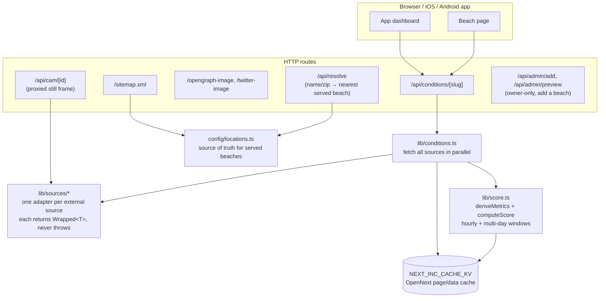
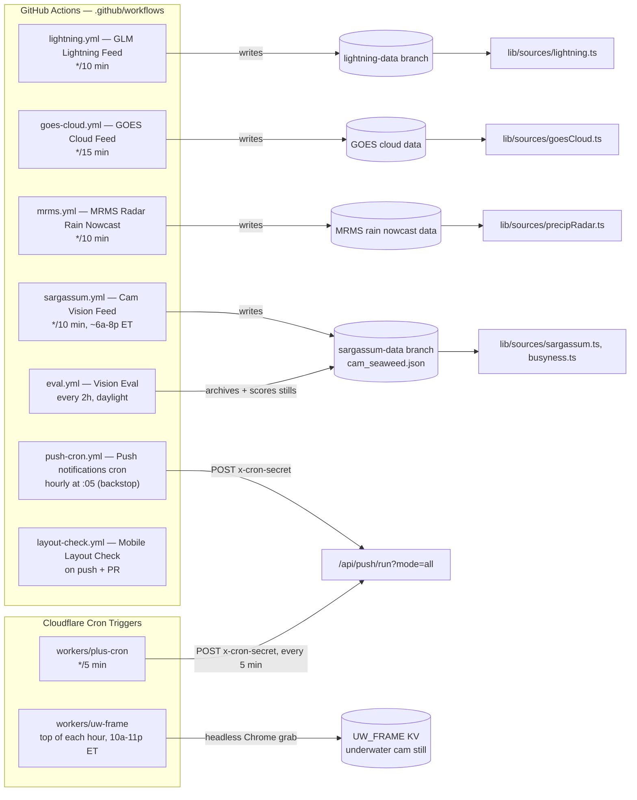
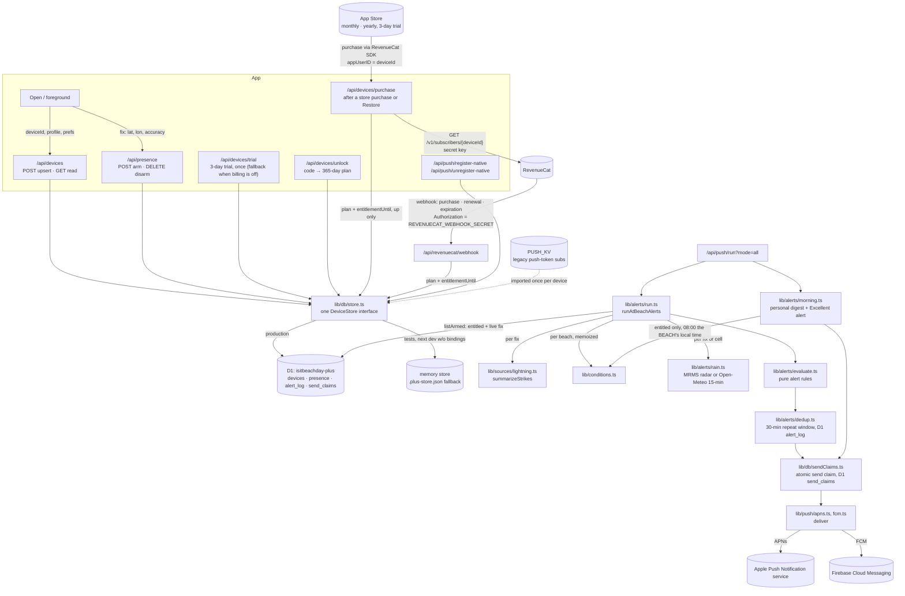

# Backend architecture — Is It Beach Day

This map shows every backend part and how it connects: the request path a
page or the app takes, the scheduled jobs that keep data fresh, and the Beach
Day Plus alert pipeline. Update this file in the same commit as any change
that adds, removes, or rewires a part.

Hosting: **Cloudflare Workers**, built with OpenNext (`npm run deploy`). See
`docs/HANDOFF.md` for the deploy command and owner to-dos.

## 1. Request path — a page or app call

Every beach page and the app both go through the same conditions pipeline.
The pipeline fetches ~18 external sources in parallel, derives metrics, and
scores the result; the response is cached so a burst of visitors doesn't
re-run all of that per request.

On the Plus side, the app also calls the device/presence routes directly
(see diagram 3).

## 2. Scheduled jobs — keeping the feeds current

Two kinds of scheduler: **GitHub Actions** (free compute, runs scripts, writes
to data branches or calls the app) and **Cloudflare Cron Triggers** (run
inside a Worker, call the app's own API).

`push-cron.yml` and `plus-cron` both hit the same route — GitHub's schedule is
best-effort, so the Cloudflare cron is the reliable path and GitHub is the
backstop. `PUSH_SAFETY_ALERTS` (a Worker var) kills every hazard alert
app-wide without a deploy.

## 3. Beach Day Plus — device, presence, and alerts

**Note on KV namespaces:** `PUSH_KV` (legacy push subscriptions) and
`NEXT_INC_CACHE_KV` (the OpenNext page/data cache) are bound to the **same
underlying KV namespace id** in `wrangler.jsonc` — OpenNext prefixes its keys,
so they don't collide, but it means one namespace serves two unrelated jobs.
Worth splitting if either one grows enough to matter.

**Beach-local scheduling:** the morning digest, "just turned Excellent", and
every hazard's freshness window are all judged in the **beach's own
timezone** (`config/locations.ts`'s `timezone`), never the phone's — a device
sees its home beach's 8 AM digest whatever zone the phone itself is in. The
phone's zone still rides along on the device row (`tz`), but only for
display; nothing in the sender schedules off it.

**Atomic send claims (`send_claims`, migrations/0004_send_claims.sql):** the
Cloudflare cron (every 5 min) and the GitHub Actions backstop (hourly) both
call `/api/push/run`, and can start within seconds of each other — both
enabled on purpose, since GitHub's schedule is best-effort. Two overlapping
runs can each read "not yet sent" from `alert_log` before either has written
its mark. Before sending any morning digest, Excellent alert, or at-beach
hazard, the sender claims `<deviceId>:<alertKey>:<window>` with an atomic
INSERT — only the run that wins the claim may send, so the 30-minute (or
once-a-day) dedup window still holds even when two runs race for it. A claim
whose send never finished (a crash, a timeout) is abandoned after 10 minutes
and may be re-claimed.

## External integrations

| Source | Used for |
|---|---|
| RevenueCat | Beach Day Plus billing: the app buys through its SDK; the server confirms with its REST API (`/api/devices/purchase`) and hears renewals/expirations on `/api/revenuecat/webhook` (see docs/BILLING_SETUP.md) |
| Open-Meteo | Forecast, hourly forecast, nowcast, minutely rain (Plus alert fallback) |
| National Weather Service (NWS) | Alerts, forecast |
| NOAA CO-OPS | Tide predictions and real water level |
| NDBC | Buoy observations (waves, water temp) |
| MET Norway | Secondary forecast model (consensus) |
| EPA AirNow / CAMS | Air quality |
| NOAA S3 (GOES, GLM, MRMS) | Cloud cover, lightning strikes, radar rain nowcast |
| Gemini / Groq / OpenRouter / GitHub Models | Beach-cam vision reads (seaweed, busyness, water clarity) |
| iNaturalist | Portuguese man-o'-war sighting reports |
| FL Healthy Beaches | Water-quality advisories |
| video-monitoring.com | Public beach cam still frames |
| YouTube | Underwater cam source (`workers/uw-frame`) |
| Apple Push Notification service (APNs) | iOS push delivery |
| Firebase Cloud Messaging (FCM) | Android push delivery |
