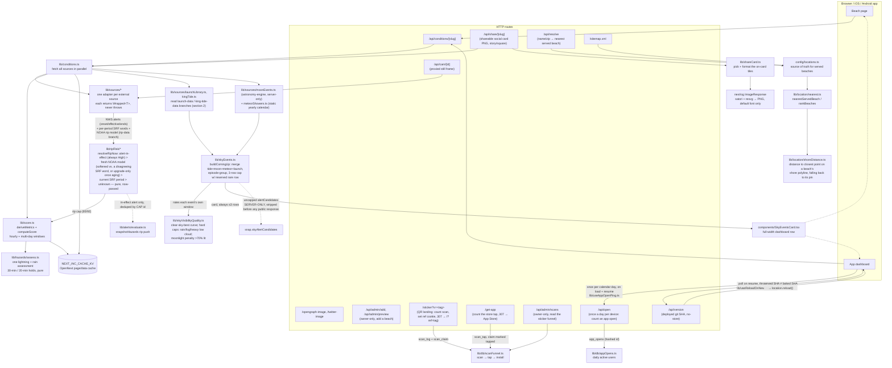

# Backend architecture — Is It Beach Day

This map shows every backend part and how it connects: the request path a
page or the app takes, the scheduled jobs that keep data fresh, and the Beach
Day Plus alert pipeline. Update this file in the same commit as any change
that adds, removes, or rewires a part.

Hosting: **Cloudflare Workers**, built with OpenNext (`npm run deploy`). See
`docs/HANDOFF.md` for the deploy command and owner to-dos.

## 1. Request path — a page or app call

Every beach page and the app both go through the same conditions pipeline.
The pipeline fetches ~18 external sources in parallel, derives metrics, and
scores the result; the response is cached so a burst of visitors doesn't
re-run all of that per request.

```mermaid
flowchart TD
  subgraph client [Browser / iOS / Android app]
    PAGE[Beach page] 
    APPUI[App dashboard]
  end

  PAGE --> COND
  APPUI --> COND

  subgraph routes [HTTP routes]
    COND["/api/conditions/[slug]"]
    SHARE["/api/share/[slug]<br/>(shareable social card PNG, story/square)"]
    RESOLVE["/api/resolve<br/>(name/zip → nearest served beach)"]
    OG["/opengraph-image, /twitter-image"]
    SITEMAP["/sitemap.xml"]
    CAM["/api/cam/[id]<br/>(proxied still frame)"]
    ADMIN["/api/admin/add, /api/admin/preview<br/>(owner-only, add a beach)"]
    STICKER["/sticker?s=&lt;tag&gt;<br/>(QR landing: count scan, set ref cookie, 307 → /?ref=tag)"]
    GETAPP["/get-app<br/>(count the store tap, 307 → App Store)"]
    ADMINSCANS["/api/admin/scans<br/>(owner-only, read the sticker funnel)"]
    VERSION["/api/version<br/>(deployed git SHA, no-store)"]
    OPENR["/api/open<br/>(once a day per device: count an app open)"]
  end

  APPUI -->|"once per calendar day, on load + resume<br/>lib/useAppOpenPing.ts"| OPENR
  OPENR -->|"app_opens (hashed id)"| OPENS[lib/db/appOpens.ts<br/>daily active users]

  APPUI -->|"poll on resume, throttled 60s<br/>lib/useReloadOnNewVersion.ts"| VERSION
  VERSION -->|"served SHA ≠ baked SHA<br/>→ location.reload()"| APPUI

  STICKER -->|"scan_log + scan_claim"| FUNNEL[lib/db/scanFunnel.ts<br/>scan → tap → install]
  GETAPP -->|"scan_tap, claim marked tapped"| FUNNEL
  ADMINSCANS --> FUNNEL

  COND --> PIPE[lib/conditions.ts<br/>fetch all sources in parallel]
  SHARE --> PIPE
  PIPE --> SOURCES[lib/sources/*<br/>one adapter per external source<br/>each returns Wrapped&lt;T&gt;, never throws]
  PIPE --> SCORE[lib/score.ts<br/>deriveMetrics + computeScore<br/>hourly + multi-day windows]
  SOURCES -->|"NWS alerts (onset/effective/ends)<br/>+ per-period SRF words +<br/>NOAA rip model (rip-data branch)"| RIPRISK["lib/ripRisk/*<br/>resolveRipNow: alert-in-effect (always High) &gt;<br/>fresh NOAA model (softened vs. a disagreeing<br/>SRF word, or upgrade-only once aging) &gt;<br/>current SRF period &gt; unknown — pure, now-passed"]
  RIPRISK -->|"rip cap (85/92)"| SCORE
  RIPRISK -.->|"in-effect alert only, deduped by CAP id"| EVAL2[lib/alerts/evaluate.ts<br/>snapshotHazards rip push]
  SCORE --> HAZ[lib/hazards/assess.ts<br/>one lightning + rain assessment<br/>30-min / 20-min holds, pure]
  SCORE --> CACHE[(NEXT_INC_CACHE_KV<br/>OpenNext page/data cache)]
  PIPE --> CACHE
  CAM --> SOURCES
  SHARE --> CARDMODEL[lib/shareCard.ts<br/>pick + format the on-card tiles]
  CARDMODEL --> IMG[next/og ImageResponse<br/>satori + resvg → PNG, default font only]

  PIPE --> SKYADAPT["lib/sources/launchLibrary.ts, kingTide.ts<br/>read launch-data / king-tide-data branches (section 2)"]
  PIPE --> SKYLIVE["lib/sources/moonEvents.ts (astronomy-engine, server-only)<br/>+ meteorShowers.ts (static yearly calendar)"]
  SKYADAPT --> SKYBUILD[lib/skyEvents.ts<br/>buildComingUp: merge tide+moon+meteor+launch,<br/>episode-group, 3-row cap w/ reserved rare row]
  SKYLIVE --> SKYBUILD
  SKYBUILD -->|"rates each event's own window"| SKYQUAL[lib/skyVisibilityQuality.ts<br/>clear-sky-best curve; hard caps: rain/fog/heavy low cloud;<br/>moonlight penalty &gt;70% lit]
  SKYBUILD -->|"card, always ≤3 rows"| SKYCARDUI[components/SkyEventsCard.tsx<br/>full-width dashboard row]
  SKYBUILD -.->|"uncapped alertCandidates<br/>SERVER-ONLY, stripped before any public response"| SKYALERT[snap.skyAlertCandidates]
  SKYCARDUI -.-> APPUI
  SKYCARDUI -.-> PAGE

  RESOLVE --> LOC[config/locations.ts<br/>source of truth for served beaches]
  SITEMAP --> LOC
  LOC --> NEAREST[lib/location/nearest.ts<br/>nearestServedBeach / rankBeaches]
  NEAREST --> SHOREDIST[lib/location/shoreDistance.ts<br/>distance to closest point on a beach's<br/>shore polyline, falling back to its pin]
```

On the Plus side, the app also calls the device/presence routes directly
(see diagram 3). `lib/location/nearest.ts` and its `shoreDistance.ts` helper
are also what `/api/hazards` and Beach Mode's arrival check (`establishesArrival`,
`lib/plus/beachMode.ts`) use to decide "which beach" / "am I at the beach" —
one shared rule, client and server.

## 2. Scheduled jobs — keeping the feeds current

Two kinds of scheduler: **GitHub Actions** (free compute, runs scripts, writes
to data branches or calls the app) and **Cloudflare Cron Triggers** (run
inside a Worker, call the app's own API).

```mermaid
flowchart LR
  subgraph gh [GitHub Actions — .github/workflows]
    LGT["lightning.yml — GLM Lightning Feed<br/>~1-min reads in ~5.5h loops, each loop dispatches the next<br/>(*/10 cron = fallback)"]
    GOES["goes-cloud.yml — GOES Cloud Feed<br/>15-min reads 5:55a-8:35p ET, idles overnight;<br/>~340-min loops, each dispatches the next (*/15 cron = fallback)"]
    MRMS["mrms.yml — MRMS Radar Rain Nowcast<br/>10-min reads around the clock;<br/>~340-min loops, each dispatches the next (*/10 cron = fallback)"]
    SARG["sargassum.yml — Cam Vision Feed<br/>10-min reads 5:55a-8:05p ET, idles overnight;<br/>~340-min loops, each dispatches the next (daytime cron = fallback)"]
    RIPNWPS["rip-nwps.yml — NOAA Rip Current Model Feed<br/>every 3h"]
    EVAL["eval.yml — Vision Eval<br/>every 2h, daylight"]
    PUSHCRON["push-cron.yml — Push notifications cron<br/>hourly at :05 (backstop)"]
    LAYOUT["layout-check.yml — Mobile Layout Check<br/>on push + PR"]
    LAUNCHLIB["launch-library.yml — Rocket Launch Feed (LL2)<br/>~30-min polls in ~4h45m loops, each dispatches the next<br/>(hourly cron = fallback)"]
    KINGTIDE["king-tide.yml — King Tide / High-Tide-Flooding Feed<br/>twice weekly, Mon + Thu"]
  end

  subgraph cf [Cloudflare Cron Triggers]
    PLUSCRON["workers/plus-cron<br/>*/5 min"]
    UWFRAME["workers/uw-frame<br/>multi-cam frame courier + Deerfield & Fort Lauderdale flag readers<br/>top of each hour, 10a-11p ET"]
  end

  subgraph mac [Owner's Mac — launchd, not a scheduler above]
    CAMCOURIER["scripts/cam_courier_local.sh<br/>hourly, residential IP"]
    SUNCAM["scripts/sun_cam_check.py<br/>every 30 min, residential IP<br/>(YouTube blocks datacenter IPs)"]
  end

  CAMCOURIER -->|"POST /ingest?cam=&lt;id&gt;<br/>Bearer token, JPEG bytes"| UWFRAME

  LGT -->|writes| LDATA[(lightning-data branch)]
  SARG -->|reads| VCAMS[config/vision-cams.json<br/>per-beach cam registry]
  SARG -->|writes| SDATA[(sargassum-data branch<br/>cam_seaweed.&lt;slug&gt;.json, one per beach)]
  RIPNWPS -->|reads| NWPSMAP[config/nwpsRip.ts<br/>beach → NWS office + nearest model grid point,<br/>built by scripts/nwps_rip_map.mjs]
  RIPNWPS -->|"downloads each mapped office's<br/>NOAA NWPS CG1 ripprob file ONCE"| NOMADS[["nomads.ncep.noaa.gov<br/>NWPS rip current model (Dusek &amp; Seim 2013)"]]
  RIPNWPS -->|writes| RDATA[(rip-data branch<br/>rip_nwps.json — its OWN branch, NOT<br/>sargassum-data, which sargassum.yml/<br/>backfill-pct.yml force-push as an orphan<br/>and would silently wipe it)]
  GOES -->|writes| GDATA[(GOES cloud data)]
  MRMS -->|writes| MDATA[(MRMS rain nowcast data)]
  EVAL -->|archives + scores stills| SDATA
  LAUNCHLIB -->|"paginated pull, throttle-aware (≤15 req/hour)"| LL2API[["Launch Library 2<br/>thespacedevs.com"]]
  LAUNCHLIB -->|"writes, single-commit orphan"| LLDATA[(launch-data branch<br/>launch_data.json)]
  KINGTIDE -->|"per-station hi/lo predictions + flood levels"| COOPSAPI[["NOAA CO-OPS<br/>tidesandcurrents.noaa.gov"]]
  KINGTIDE -->|"writes, single-commit orphan"| KTDATA[(king-tide-data branch<br/>king_tide_data.json)]

  LDATA --> SOURCES2[lib/sources/lightning.ts]
  SDATA --> SOURCES3[lib/sources/sargassum.ts, busyness.ts, clarity.ts]
  RDATA -->|rip_nwps.json| SOURCES6[lib/sources/ripNwps.ts<br/>per-beach hourly probability series,<br/>stale &gt;36h treated as unavailable]
  SOURCES6 --> RIPRESOLVE[lib/ripRisk/resolve.ts<br/>resolveRipNow: alert &gt; fresh model &gt; SRF forecast &gt; unknown]
  SOURCES3 -->|"last 2 weeks of read times"| CAMNEXT[lib/camNextRead.ts<br/>learns the next cam read time,<br/>no fixed schedule]
  GDATA --> SOURCES4[lib/sources/goesCloud.ts]
  MDATA --> SOURCES5[lib/sources/precipRadar.ts<br/>parses lastWetIso → wetMinutesAgo<br/>on the server clock]
  LLDATA --> SOURCES7[lib/sources/launchLibrary.ts<br/>per-beach LaunchSkyEvent: bearing/distance,<br/>range-tier eligibility, day/twilight/night light state]
  KTDATA --> SOURCES8[lib/sources/kingTide.ts<br/>per-station flood-threshold + top-1%-of-year<br/>episodes, episode-merged]

  PUSHCRON -->|POST x-cron-secret| RUN["/api/push/run?mode=all"]
  RUN -->|"at-beach hazards read the SAME<br/>assessment the score caps use"| HAZ2[lib/hazards/assess.ts<br/>lightning from the device fix,<br/>rain from the beach radar or the fix's cell forecast]
  PLUSCRON -->|POST x-cron-secret, every 5 min| RUN
  HISTCRON["workers/history-cron<br/>Cloudflare Cron every minute"] -->|POST x-cron-secret| HIST["/api/history/archive<br/>ONE build per call (Workers Free = 50 subrequests/request;<br/>a cold build is ~25); scans candidates least-recently-archived first,<br/>claims (slug, hour_utc) with a 10-min abandonment window,<br/>reserves budget BEFORE fetching"]
  HIST -->|getConditions per beach<br/>daylight-only for auto beaches| PIPE
  HIST -->|"beach_hourly (score as shown + inputs, plus extra_json:<br/>surf, sand, rip, storm, feels-like, water trend, vs-average,<br/>safety levels, best window, sky ratings — lib/history/extra.ts),<br/>history_budget (free-tier guard, 600 builds/UTC-day;<br/>HISTORY_ENABLED=off pauses it)"| D1[(D1 isitbeachday-plus)]
  HIST -->|"sun_event_predictions (migrations/0013): the sunrise + sunset the card shows<br/>(event kept until its golden window closes — lib/sunCardEvent.ts, shared with the card),<br/>one row per beach per archive hour, score + every input, one multi-row upsert,<br/>same assembleSunEventQuality as the card and the alert; retried once inline,<br/>never fails the beach_hourly row; observed_* filled later by SUNOBS"| D1
  SDATA -->|"history[] + latest/morning per-cam reads, read through the same<br/>lib/sources/camFeed.ts URL resolver the live sources use"| HIST
  HIST -->|"cam_observations (every history[] read not yet stored: crowd, seaweed, water,<br/>clarity, underwater uw) + cam_reads (per-cam detail), migrations 0006/0014,<br/>INSERT OR IGNORE, vision-cam beaches only (config/vision-cams.json),<br/>lib/history/camObservations.ts; a feed failure never fails the beach_hourly row"| D1
  BACKFILL["scripts/backfill_cam_history.mjs (one-shot; shares<br/>lib/history/camObservationRow.mjs with the archiver)"] -->|cam_observations| D1
  SUNCAM -->|"yt-dlp -J → HLS playlist (~4 h DVR); one frame every 2.5 min,<br/>event −35 … +25 min, per config/sun-cams.json cam"| YTLIVE[["YouTube livestream DVR<br/>Elbo Room + 3 Deerfield cams, all facing east"]]
  SUNCAM -->|"POST /api/sun-observations — Bearer INGEST_TOKEN<br/>robust-peak score + series + scored_at, per beach / event / cam;<br/>incomplete captures are never sent"| SUNOBS["/api/sun-observations<br/>constant-time auth, bounded 32 KB read, strict validation<br/>that recomputes coverage + robust peak (lib/sunObservations.ts)"]
  SUNOBS -->|"sun_event_observations (migrations/0015)<br/>upsert only when (score_version, scored_at) is newer —<br/>duplicates and stale replays are no-ops; credit stored"| D1
  SUNOBS -->|"observed_score / observed_source / observed_at on the<br/>sun_event_predictions rows (event within 15 min; best cam:<br/>solar view first, then nearest; never a hand label)"| D1
  UWFRAME -->|one headless-Chrome launch/tick,<br/>reused across every cam + the flag read| UWKV[(UW_FRAME KV<br/>frame:&lt;id&gt;, meta:&lt;id&gt;,<br/>flags:deerfield-beach, flags:fort-lauderdale)]
```

**`workers/uw-frame` is a multi-cam courier, not a single grab.** Deerfield
Beach's cams (underwater, crowd/sand, surf, pier) plus Fort Lauderdale
Beach's Elbo Room cam (crowd/sand, owner approved) exist only as YouTube live
streams — there's no still-image feed — so each cron tick opens ONE headless
Chrome and reuses the SAME page across every camera due that tick (navigate
the embed, wait for it to actually be playing, screenshot, move to the next
cam) rather than launching a browser per camera. The same browser also loads
the City's public ArcGIS "Beach Conditions" dashboard once per daylight tick
to read which lifeguard flag(s) are currently flying — that dashboard shows
the active flag(s) by toggling block visibility rather than changing text, so
the reader records which of the five known blocks is actually visible. The
underwater cam still grabs hourly (unchanged); the three surface cams grab
every 3 hours in daylight only, and the flag read runs every daylight tick —
all three cadences, and the full per-day Browser Rendering time budget, are
decided in `workers/uw-frame/src/lib/schedule.ts` and documented in
`workers/uw-frame/src/index.ts`. Endpoints: `GET /frame[?cam=<id>]`,
`GET /meta[?cam=<id>]` (no `cam` = the underwater cam, unchanged legacy
keys), `GET /cams` (registry + each cam's last grab), and
`GET /flags?slug=deerfield-beach`, `GET /flags?slug=fort-lauderdale`.

**Fort Lauderdale lifeguard flags.** The City of Fort Lauderdale Fire Rescue posts a plain-text "Beach Conditions" page once a day (flags, sea-pest notes, ocean conditions, water temperature). A plain fetch gets a 403 bot-block, so `uw-frame` opens it in Browser Rendering on the same daylight-gated tick as the Deerfield read, reads `document.body.innerText`, parses it with the pure section parser `workers/uw-frame/src/lib/ftlConditions.ts`, and stores `flags:fort-lauderdale` in the same `{flags, observedAtUtc, ok}` shape `lib/sources/cityOfficial.ts`'s `mapFlagsFeed` expects, plus `pageDate`, `seaPests`, `seaPestsPresent`, `waterTempF`, `oceanConditions`. Because the City posts daily, a page more than 2 calendar days old (America/New_York) is written `ok:false`, which the app shows as "unknown" rather than a stale flag. A failed or stale read never overwrites a good stored one (the attempt lands under `flags-attempt:fort-lauderdale`). `seaPests` is captured but not yet shown in the UI.

As of September 2026, frames arrive from the owner's Mac courier
(`scripts/cam_courier_local.sh`, hourly, residential IP) via `POST /ingest`;
the Worker's own headless-Chrome grab remains as a fallback. YouTube now
blocks video playback from Cloudflare's browser fleet, so the Mac — a normal
home connection — grabs each frame and sends it to the Worker instead. Both
paths write through the same guard, so neither can overwrite the other's
newer good frame; `GET /cams` shows which path supplied each camera's
current frame in its `source` field ("courier" or "browser").

**The sun-cam check gives every sunrise and sunset a "what actually happened"
score.** `scripts/sun_cam_check.py` runs on the owner's Mac every 30 minutes
(`scripts/com.isitbeachday.suncam.plist`; YouTube blocks datacenter IPs, so it
cannot run in a Worker or Action). It reads the 24/7 east-facing livestreams in
`config/sun-cams.json`. YouTube keeps ~4 hours of DVR for each, so a run up to
3.5 hours after an event rebuilds it: one frame every 2.5 minutes from 35
minutes before to 25 minutes after the event, each scored 0-100 on how much of
the sky is lit warm. The event's score is a robust peak (a frame counts for at
most twice its best neighbor, so one glitch frame cannot win), and a capture
without enough frames before, around, and after the event is never uploaded. The result goes to
`POST /api/sun-observations` with the courier's `INGEST_TOKEN`, lands in
`sun_event_observations` (migrations/0015), and the best observation (solar view
first, then nearest cam) is copied onto the matching `sun_event_predictions`
rows. Sunrise views are `solar`, sunset views `antisolar`. Every stored row
carries the cam owner's credit string (Elbo Room asked for one). See
`docs/SUN_CAM_CHECK.md`.

**Feed loops relay to themselves.** GitHub's cron is best-effort — Sep 24-28
2026 it left loops unrestarted for hours (lightning 109 min with stale
lightning data; goes-cloud and the cam feed 4-5 h late every morning). So the
five looping feeds (`lightning`, `goes-cloud`, `mrms`, `sargassum`,
`launch-library`) each end with a small `handoff` job that dispatches the
next loop (`gh workflow run`, `actions: write` on that job only — GITHUB_TOKEN
may trigger `workflow_dispatch`, so no secret). It skips a cancelled run (a
newer run already replaced it under `cancel-in-progress`) and a loop that
ended within 15 min (no tight respawn cycle), and only runs on `main`. The two
daylight feeds idle overnight instead of exiting, so the first morning read
lands at ~06:00 ET (the first :00/:10/:15 grid point after the 05:55 window
opens), not whenever the cron next fires. Each workflow's own cron stays as the fallback if a run
dies before its handoff.

`push-cron.yml` and `plus-cron` both hit the same route — GitHub's schedule is
best-effort, so the Cloudflare cron is the reliable path and GitHub is the
backstop. `PUSH_SAFETY_ALERTS` (a Worker var) kills every hazard alert
app-wide without a deploy.

**Cam vision is per-beach.** `sargassum.yml` no longer reads one hard-coded
Boca cam list: `scripts/cam_seaweed.py` loads `config/vision-cams.json` (one
entry per beach, each with its own cams and a `kind` of `feed`,
`direct`, or `hls`) and processes every registered beach in the same run,
publishing one `cam_seaweed.<slug>.json` per beach to `sargassum-data`. A
`vitest` (`lib/visionCams.test.ts`) cross-checks the registry against
`config/locations.ts` so the two never drift apart. `lib/sources/camFeed.ts`
builds each beach's feed URL from `loc.slug`; `sargassum.ts` and `busyness.ts`
both use it, and Boca Raton alone falls back to the pre-split single-file
`cam_seaweed.json` (which the job still publishes as a copy, for one release)
if its own per-beach file isn't there yet. The underwater "Spinner the Sea
Cam" read stays a single per-run calibration signal — the same `uw` value is
copied onto every beach's file, not read once per beach.

**NOAA's rip current model is preprocessed, not fetched live.** NOAA's NWPS
probabilistic rip current model (Dusek & Seim 2013) publishes one ~2.5MB text
file per NWS office, hourly, 6 days out — too big to fetch per page load.
`scripts/nwps_rip_map.mjs` is a one-time (re-runnable) script that, for every
beach in `listLocations()`, finds the covering NWS office via
`api.weather.gov/points` and the nearest model grid point (accepted only
within 3km of the shoreline), writing the static `config/nwpsRip.ts` —
currently 27 of 39 beaches (only coastal offices run the model). `rip-nwps.yml`
runs `scripts/rip_nwps.mjs` every 3h: for each DISTINCT office in the map, it
downloads that office's latest CG1 ripprob file ONCE (today 12z → 00z →
yesterday 12z → 00z, each fetch under a 20s abort timeout), extracts every
mapped beach's nearest point, and publishes a single small `rip_nwps.json`
(72h of hourly probability + wave/period/direction per beach) to its OWN
**`rip-data`** branch — deliberately NOT `sargassum-data`: that branch is
force-pushed as a single-commit orphan by both `sargassum.yml` (~every 10 min)
and `backfill-pct.yml`, which silently deletes anything else published there
(a prior version of this file lived on `sargassum-data` and was wiped
repeatedly). A downloaded run is only ACCEPTED if it sanity-checks (non-empty
grid, in-range probabilities, hourly coverage of `now..+24h` with no gaps);
one that fetches but fails those checks, or fails to fetch after one retry,
falls through to an older cycle and ultimately carries that office's beaches
forward from the previous publish with their ORIGINAL run time, never faking
freshness. Every row's `prob` is validated to [0, 100] (sentinels like
-999/9999 are dropped, not clamped) both in the job and again, defensively, in
the adapter.

`lib/sources/ripNwps.ts` reads that file (an in-flight promise shared by
concurrent callers, so a cold build fetching many beaches at once issues ONE
request; stale >36h = unavailable) and `lib/ripRisk/resolve.ts`'s
`resolveRipNow` folds it in: an alert actually IN EFFECT always resolves
HIGH; otherwise a model run ≤18h old can pull the result ONE band below a
disagreeing Surf Zone Forecast word (never further), a run 18-36h old can only
UPGRADE the SRF word, never downgrade it; with no fresh model, the SRF word
governs; with neither, unknown. (An earlier experimental wave/tide/wind
physics estimate was removed from this hierarchy — never wired past its own
tests — see `lib/ripRiskCurve.ts`, which is a separate, still-used system
that shapes the CARD's hourly curve for beaches with no model coverage.) The
dashboard's own clock ticks every 60s post-mount (matching `RipRiskCard`'s
convention) so this resolution — and the score's rip cap shown client-side —
stays live rather than freezing at whatever was true when the tab loaded.

**The "Coming up" sky-events card follows the same "preprocess, don't fetch
live" pattern.** `launch-library.yml` polls Launch Library 2 every 30
minutes, inside an hourly-triggered ~4h45m loop (the same GitHub-cron-
unreliability workaround as `lightning.yml`), and publishes `launch_data.json`
to its own `launch-data` branch. `king-tide.yml` runs twice a week — tide
predictions are deterministic astronomy, not a live model, so a fast cadence
buys nothing — and publishes `king_tide_data.json` to its own
`king-tide-data` branch. Each feed gets its own branch for the same reason
`rip-data` does: `sargassum-data` is force-pushed as an orphan branch by two
other jobs and would silently wipe anything else stored there. A failed or
partial run on either feed publishes nothing, so the previous good file stays
live. `lib/sources/launchLibrary.ts` turns each feed entry into a per-beach
`LaunchSkyEvent`: bearing, distance, a range-tier eligibility check, and
day/twilight/night light state, each worked out at the launch's own liftoff
time. `lib/sources/kingTide.ts` turns each station's predictions into merged
flood-threshold and top-1%-of-year episodes. Two more event types need no
feed at all: `lib/sources/moonEvents.ts` computes full moons, supermoons, and
eclipses live with `astronomy-engine` (server-only — it must never reach a
client bundle), and `lib/sources/meteorShowers.ts` reads a static yearly
calendar. `lib/skyEvents.ts`'s `buildComingUp` merges all four sources into
one ordered card, capped at 3 rows (an eclipse or a launch reserves its row
over routine events when there are more than 3), and rates each event's own
window with `lib/skyVisibilityQuality.ts`: clear sky scores best, any cloud
only lowers the score, and rain, fog, near-total low cloud, or a Moon over
70% lit each cap the result outright. `components/SkyEventsCard.tsx` renders
the capped card full-width in the dashboard; the uncapped candidate list
stays server-only (`snap.skyAlertCandidates`) for the alert path in section 3
below.

## 3. Beach Day Plus — device, presence, and alerts

```mermaid
flowchart TD
  subgraph app [App]
    OPEN[Open / foreground] -->|deviceId, profile, prefs| DEV["/api/devices<br/>POST upsert · GET read"]
    OPEN -->|fix: lat, lon, accuracy| PRES["/api/presence<br/>POST arm · DELETE disarm"]
    TRIAL["/api/devices/trial<br/>3-day trial, once (fallback when billing is off)"]
    UNLOCK["/api/devices/unlock<br/>code → 365-day plan"]
    BUY["/api/devices/purchase<br/>after a store purchase or Restore"]
    REG["/api/push/register-native<br/>/api/push/unregister-native"]
    HAZ2["/api/hazards<br/>POST — native-only, rate-limited<br/>'where you stand' lightning + rain"]
    LAREG["/api/live-activity/register<br/>POST — native-only, rate-limited<br/>start/rotate a Beach Session token"]
    LAEND["/api/live-activity/end<br/>POST — native-only, rate-limited<br/>Off / dismiss"]
    HIST2["/api/history/[slug]<br/>POST — native-only, rate-limited<br/>'Last N days': day summaries + records"]
  end

  APPSTORE[(App Store<br/>monthly · yearly, 3-day trial)] -->|"purchase via RevenueCat SDK<br/>appUserID = deviceId"| BUY
  BUY -->|"GET /v1/subscribers/{deviceId}<br/>secret key"| RC[(RevenueCat)]
  RC -->|"webhook: any event with a mappable device id<br/>Authorization = REVENUECAT_WEBHOOK_SECRET"| RCHOOK["/api/revenuecat/webhook"]
  RCHOOK -->|"reconcile: GET /v1/subscribers/{deviceId}<br/>same secret key — never trusts the event's own meaning"| RC

  DEV --> STORE[lib/db/store.ts<br/>one DeviceStore interface]
  PRES --> STORE
  TRIAL -->|claimTrial: trialUntil, once, atomically| STORE
  UNLOCK -->|codeUntil| STORE
  BUY -->|storeUntil, up only| STORE
  RCHOOK -->|storeUntil, from RC's live answer| STORE
  REG --> STORE

  STORE -->|production| D1[(D1: isitbeachday-plus<br/>devices · presence · alert_log · send_claims<br/>scan_log · scan_tap · scan_claim · install_attrib<br/>live_activities · app_opens)]
  LAREG -->|"entitled + armed at slug (listArmed gate)<br/>one active session/device, token rotation"| STORE
  LAEND -->|markLiveActivityEnded 'user'| STORE
  HIST2 -->|"hourlyHistory: read-only beach_hourly<br/>(same D1, written by the archiver — diagram 2)"| STORE
  STICKER -->|"count scan (bot-filtered), fail-soft"| D1
  GETAPP -->|"count store tap, fail-soft"| D1
  DEV -->|"after the upsert: credit a fresh native install<br/>to a recent scan on the same network (probable)"| ATTRIB[lib/db/scanFunnel.ts<br/>attributeInstall]
  REG --> ATTRIB
  ATTRIB --> D1
  ADMINSCANS -->|read the funnel| D1
  STORE -->|tests, next dev w/o bindings| MEM[(memory store<br/>.plus-store.json fallback)]

  KVLEGACY[(PUSH_KV<br/>legacy push-token subs)] -.imported once per device.-> STORE

  HAZ2 -->|"per fix"| STRIKES
  HAZ2 -->|"per fix or beach radar"| RAIN
  HAZ2 -->|"beach's own cached pair"| PIPE2
  HAZ2 -->|"assessLightning/assessRain"| HAZASSESS[lib/hazards/assess.ts<br/>one lightning + rain assessment<br/>30-min / 20-min holds, pure]

  RUN["/api/push/run?mode=all"] --> ATBEACH[lib/alerts/run.ts<br/>runAtBeachAlerts]
  RUN --> MORNING[lib/alerts/morning.ts<br/>personal digest + Excellent alert]

  ATBEACH -->|listArmed: entitled + live fix| D1
  ATBEACH -->|per fix| STRIKES[lib/sources/lightning.ts<br/>summarizeStrikes]
  ATBEACH -->|per beach, memoized| PIPE2[lib/conditions.ts]
  ATBEACH -->|per fix or cell| RAIN[lib/alerts/rain.ts<br/>MRMS radar or Open-Meteo 15-min]
  ATBEACH --> EVALRULES[lib/alerts/evaluate.ts<br/>pure alert rules]
  EVALRULES --> DEDUP[lib/alerts/dedup.ts<br/>30-min repeat window, D1 alert_log]

  MORNING -->|entitled only, 08:00 the BEACH's local time| PIPE2

  DEDUP --> CLAIM[lib/db/sendClaims.ts<br/>atomic send claim, D1 send_claims]
  MORNING --> CLAIM
  CLAIM --> SEND[lib/push/apns.ts, fcm.ts<br/>deliver]
  SEND -->|APNs| APNS[(Apple Push Notification service)]
  SEND -->|FCM| FCM[(Firebase Cloud Messaging)]

  %% "Coming up" sky-events alert (Phase 3) — Plus, opt-in, at most one sky
  %% event a day and three a month per device (coming_up_deliveries own
  %% caps), never a second push alongside "turned Excellent".
  RUN -->|"beach-local 8:00 AM window only (DST-aware)"| COMINGUP[lib/alerts/comingUp.ts<br/>selectComingUpEvent over snap.skyAlertCandidates:<br/>eclipse &gt; validated tide &gt; meteor &gt; supermoon &gt; launch]
  PIPE2 -.->|"snap.skyAlertCandidates<br/>uncapped, SERVER-ONLY"| COMINGUP
  COMINGUP -->|"claimComingUp: 24h/30d caps"| CUD[(coming_up_deliveries<br/>migrations/0011, one row per device+event)]
  CUD -->|"reserved"| CUROUTE{{"resolved by exactly ONE:<br/>1) append to morning digest body<br/>2) else coalesce into 'turned Excellent' body<br/>3) else standalone push"}}
  MORNING --> CUROUTE
  CUROUTE --> SEND
  CUROUTE -->|"completeComingUp / releaseComingUp"| CUD

  %% Sunrise/sunset color alert — Plus, opt-in, standalone only (no
  %% coalescing with the digest or "turned Excellent": its own short
  %% lead-time window, not the 8 AM run those two share).
  PIPE2 -.->|"same res already fetched<br/>for the digest/Excellent check, no extra call"| SUNCOLOR["lib/alerts/sunColor.ts<br/>sunColorDecision over lib/sunAlert.ts's predictNextSunEvent:<br/>score &ge; device's cutoff (Great 70 / Amazing 90) AND<br/>now in [event&minus;lead, event&minus;lead+10min) AND event &le;4h away"]
  SUNCOLOR --> CLAIM
  SUNCOLOR -->|"alert_log key sun-color:&lt;kind&gt;:&lt;beach-local date&gt;,<br/>once per event, ever"| D1

  %% Beach Session Live Activity (docs/LIVE_ACTIVITY_PLAN.md Phase 3) — one
  %% evaluation, two independent fan-outs from the SAME armed-session loop.
  ATBEACH -->|"listActiveLiveActivities + due-end sweep<br/>(expired presence or expires_at)"| D1
  ATBEACH -->|"per activity: contentStateFromConditions<br/>(fed the ONE lightning assessment evaluateAtBeach already computed<br/>— no second assessLightning call)"| LASTATE[lib/liveActivity/state.ts<br/>contentStateFromConditions, hashContentState]
  LASTATE --> LADECIDE[lib/liveActivity/server/decide.ts<br/>lightning-escalate / hash-change+60s / 15-min heartbeat]
  LADECIDE --> CLAIM
  CLAIM --> LASEND["lib/push/apns.ts<br/>sendLiveActivityUpdate<br/>apns-push-type: liveactivity"]
  LASEND -->|APNs| APNS
```

**The "coming up" sky-events alert only runs during a beach's own 8:00 AM
window** (the same beach-local, DST-aware boundary the morning digest uses),
and only for a Plus device that opted in. `lib/alerts/comingUp.ts` picks at
most one event from that beach's uncapped candidate list, by priority:
eclipse, then a validated flood-threshold tide crossing, then a major meteor
peak, then a supermoon, then a launch. The pick is claimed in
`coming_up_deliveries` (migrations/0011) before anything is sent — that
claim is the whole concurrency guard, and also enforces the caps (one
sky-event push a day, three a month per device). The claimed event then goes
out exactly once, by whichever of three paths applies first: appended to the
morning digest body, coalesced into a same-run "turned Excellent" push, or,
if neither is due, sent standalone — a device is never sent two pushes for
the same pick.

**The sunrise/sunset color alert is opt-in, standalone-only, and off by
default**, same as coming-up. `lib/sunAlert.ts`'s `assembleSunEventQuality`
is the ONE function both `components/SunQualityCard.tsx` and the alert
(`predictNextSunEvent`) call for the nearest hourly cloud/humidity reading
and current air quality — off the SAME conditions build the digest/Excellent check already fetched
for that beach (no extra outbound call). `predictNextSunEvent` is scored
against the conditions snapshot's OWN `generatedAt`, not the push run's
wall clock, so it agrees with what the card would show for that exact
snapshot. The GOES reading is resolved and archived but, since sun model
version 2026-10-06.2, not scored: near sunrise/sunset the clear-sky mask only
has cloud overhead, which is the color canvas, not a horizon blocker
(docs/benchmarks/2026-10-06-sun-model). `lib/alerts/sunColor.ts`'s
`sunColorDecision` sends only when the predicted score clears the device's
own threshold (Great-or-better, score &ge; 70, or Amazing-only, score &ge;
90 — `lib/sunQuality.ts`'s own band cutoffs) AND the REAL wall clock falls
inside `[event − lead, event − lead + 10 min)`, where `lead` is the
device's own 30/60/120/180-minute choice — AND the predicted event is no
more than 4 hours away (a farther-out forecast isn't trustworthy enough to
alert on). A transient send failure releases its claim immediately via
`store.releaseSend` (ownership-safe — see below) rather than waiting out
the 10-minute abandoned-claim window, so the very next 5-minute cron tick
can already retry it inside the same window. Both settings live on the
`devices` row itself (`sun_color_min_band`/`sun_color_lead_min`,
migrations/0012), not in `prefs_json`, since that blob is typed as a strict
boolean map. Dedup is the plain `alert_log` mechanism every other
home-tier alert uses — `sun-color:<kind>:<beach-local date>`, once per
event, ever, even if the score later climbs back over the cutoff.

**Two distinct event identities, on purpose.** The dedupe key above comes
from `sunColorDecision`, off the REAL conditions snapshot — that's the one
that must never disagree with itself about whether a given event was
already sent. `slugConditionsNeed`'s own SELECTOR uses a separate, cheaper
ESTIMATE identity (`sunColorEstimateKey`, off `lib/sources/sun.ts`'s pure
`computeSunTimes` — no fetch), built the exact same way
(`sun-color:<kind>:<beach-local date>`) but from a pure calculation that can
disagree with the real snapshot by a few minutes, or even — right at a
boundary — name a different event kind. `slugConditionsNeed` marks a beach
`candidate` whenever the ESTIMATE's next event is within roughly 4h, and
`due` only once inside the estimate's own send window (with a little slack
on the window's END only — never the start, so a beach is never selected
before its window has genuinely opened) — but the real anti-starvation
guarantee is narrower than "never starved": once a device has been
evaluated INSIDE its (real, snapshot-based) send window this run — any
outcome except a transient failure or an unsettled claim race —
`sent.sunColorCheckedKey` latches the ESTIMATE's identity for that event
(not the snapshot's), and `slugConditionsNeed` stops treating the device as
due/candidate for it. Latching the ESTIMATE's identity, even when it
disagrees with the snapshot, is deliberate: it's the estimate the SELECTOR
reads, so it's the estimate that must stop being reselected; if the
snapshot's true event later turns out to differ, it gets its own, later
estimate window on its own terms. Without this latch, a device with
nothing further to send would keep its beach `due` for the whole window,
crowding out other same-timezone beaches' round-robin slots.

**Disagreement must converge (`sunColorMismatchOutcome`).** The ESTIMATE
and the real snapshot can disagree right up to the moment a fetch actually
happens, so a fetch made because the ESTIMATE came due resolves into exactly
one of three outcomes, never a repeat fetch loop: (1) the real snapshot's
own prediction is ALSO in its send window (or already past its cutoff) →
latch the ESTIMATE key now, same as before. (2) the snapshot has a
prediction of the SAME kind whose window starts in the future but within 15
minutes (`SUN_COLOR_MISMATCH_DEFER_MAX_MS`) → don't latch; instead
`sent.sunColorDeferUntilMs` is set to that real window's start. (3) anything
else — no prediction, a different kind, or a real window more than 15
minutes away, or already closed — → latch the ESTIMATE key immediately;
nothing can be sent for that estimated event no matter how many more times
this beach is asked. Every branch still resolves within a bounded number of
fetches per event, which is what keeps a disagreement from holding a beach
`due` (and re-fetching) forever.

**A persisted defer is itself a due window, not a single instant a 5-minute
tick can step right over (round-4 item 1).** The first cut of outcome (2)
above held the beach at `candidate` for the whole wait — but `candidate`
alone still triggers a real conditions fetch, the same as `due` does, so it
never actually stopped the pointless re-fetching it was meant to stop.
`sunColorSlugNeed` now reads `sunColorDeferUntilMs` as three ranges:
strictly before it → NEITHER `due` nor `candidate` (genuinely no fetch at
all); from it through one real send-window's width past it
(`SUN_COLOR_SEND_WINDOW_MS`, since the value literally IS that real
window's own start) → both `true`, so a fetch lands and the route runs its
ordinary decision (the real window should now be open; if a later snapshot
has moved again, the outcome check above settles it either way); past that
width — a tick never landed inside it — → expired, falls through to the
plain estimate check, which by then finds the window long closed and
returns not-due (the same practical effect as a latch, without literally
writing `sunColorCheckedKey`).

**Ownership-safe send claims (`releaseSend`/`markSent`).** Both take the
exact `nowMs` the caller originally passed to `claimSend` for that key, and
both only take effect `WHERE claimed_at = <that value>` — if the claim was
abandoned and reclaimed by a LATER run in the meantime (which stamps a NEW
`claimed_at`), a stale caller's belated release or mark is a no-op rather
than corrupting the reclaimer's live row. Both return whether they actually
matched; the sun-color block logs a warning (never treated as a hard
failure — the send itself, if any, already happened) when they don't. A
lost `claimSend` race is itself non-terminal: the losing run checks
`alert_log` before deciding whether to latch the estimate key — terminal
only if another run has ALREADY confirmed the send, otherwise the device
stays un-latched so a later tick can re-evaluate.

**Sun-color settings saves — one queue, a pending overlay that survives any
response, AND a response-revisioning watermark (`lib/plus/client.ts`).**
Both fields (`minBand`/`leadMin`) go through a SINGLE `createSunColorSaver`
(`createSerialQueue`-backed, same helper Live Activity's client already
used), so a live edit and `flushPending`'s own retry can never race each
other into two concurrent `POST /api/devices` calls — whichever was
submitted LAST is always the last one processed. `queuePending` writes the
patch to local storage synchronously, before the network call even starts,
so it survives a reload. On success, `apply` is called UNGATED (no
"is this response stale" check of its own) because `applyDevice` itself —
the one place EVERY server response of any kind gets adopted — overlays
whatever sun-color field is still pending/in-flight (`overlayPendingSunColor`)
on top of that response before rendering it. That overlay is what actually
keeps an unrelated response (an older sun-color save's own now-superseded
reply, or even a completely unrelated prefs toggle) from visibly reverting
an edit that hasn't resolved yet — the protection lives centrally in
`applyDevice`, not duplicated in the saver itself. `revert` (only called on
a failure) still checks the patch is still the CURRENT pending value before
touching local state, since it mutates state directly rather than going
through `applyDevice`'s overlay. Round-4 item 3 adds a second, earlier
guard in front of all of this: two overlapping requests for the SAME device
can resolve out of order (response ARRIVAL order isn't request order), so
`applyDevice` tracks the `updatedAt` (bumped by the server on every write,
now part of `DeviceRecord`) it last applied PER DEVICE ID, and ignores any
response `<=` that watermark outright — no cache write, no state change,
before the pending overlay even runs. This is what protects against a case
the overlay alone can't: a delayed reply to an EARLIER, unrelated request
(its own pending entry already cleared) landing after a newer save has
already applied. Round-5 item 1 closes the gap that made an EQUAL
`updatedAt` unsafe to treat as fresh: `Date.now()` alone can repeat (two
writes inside the same millisecond) or go backwards (a clock adjustment),
so every writer on `devices` (the main upsert, `claimTrial`,
`clearPushToken`, `setInstallTokenHash`, `setSent`, `patchSent` — d1Store's
SQL, and memoryStore's mirrored `applyPatch`) now sets
`updated_at = MAX(prior + 1, now)` on every UPDATE path (never plain
`?now` — only the one-time INSERT keeps that, since there is no prior row
to be monotonic against yet). With that guarantee, `applyDevice` rejects
`<=`, not just `<`: an EQUAL value can only describe the exact write this
phone already applied, never a genuinely different one.

**Every write that changes what a `DeviceRecord` carries must bump the
OWNING device row's revision — even one that writes a different table
entirely (round-6).** `setPresence`/`clearPresence` write only the
`presence` table (arm/disarm), never a column on `devices` itself — but the
`DeviceRecord` an arm/disarm response hands back DOES change (its
`presence` field). Without bumping `devices.updated_at` too, that response
would carry the SAME revision as whatever the phone already applied, and
the strict `<=` check above would silently drop it — the phone stays stuck
showing "unarmed" after a successful arm, or vice versa. Both methods now
also `UPDATE devices SET updated_at = MAX(COALESCE(updated_at, 0) + 1,
?now) WHERE id = ?`, in the SAME `db.batch()` as their own presence
write (d1Store) or the same synchronous call (memoryStore) — atomic, so the
presence table and the owning row's revision can never be observed out of
step. `live_activities` registration (`/api/live-activity/register`, `/end`)
needed no equivalent fix: neither route ever returns a `DeviceRecord` in the
first place.

**Per-tick capacity is `passes x PUSH_RUN_MAX_BEACHES`, and `dueRemaining`
counts retryable work too.** `PUSH_RUN_MAX_BEACHES`
caps how many `due` slugs one `/api/push/run` request (one "pass") selects;
`workers/plus-cron` makes up to 6 passes per 5-minute tick, SEQUENTIALLY,
each its own request with its own subrequest budget, stopping early the
moment a pass's JSON response reports `dueRemaining: 0` (every `due` slug
this tick got served — the coming-up/morning-digest/sun-color alerts all
share this one signal). `dueRemaining` isn't just slugs the round-robin cap
excluded: a slug the pass DID reach, but where the conditions load itself
threw or returned null, where some device's evaluation ended non-terminal
(a transient send failure, or a lost-claim race no other run has yet
confirmed — `comingUpTerminal`/`sunColorTerminal === false`), or where a
device's own evaluation THREW outright (round-5 item 2 — the per-device
`catch`, which used to only count toward `errors`), is folded in too, once
per slug — that beach still has real, time-sensitive work outstanding, so
the cron must not treat it as settled. So one tick's real capacity is
`passes x cap`
(6 x 2 = 12 by default), and a whole send window's capacity is that,
times how many ticks the window spans. If a tick's LAST pass still reports
`dueRemaining > 0`, `workers/plus-cron` logs a warning — the alarm that
capacity genuinely wasn't enough this tick (raise `PASSES_PER_TICK` or
`PUSH_RUN_MAX_BEACHES` if this fires routinely, rather than the window
simply catching up next tick).

**Grant-source model.** `devices` keeps three independent expiries —
`store_until` (a purchase, mirrored from RevenueCat), `code_until` (an
unlock code), `trial_until` (the free trial) — instead of one shared
`plan`/`entitlement_until`. Effective access is the LATEST of the three, and
`plan`/`entitlement_until` are recomputed from them on every write, so a
route can only ever move ITS OWN grant, never overwrite someone else's: a
30-day Restore can't shorten a 365-day code, and a store refund clears only
`store_until`, leaving a code or trial grant standing. Every write goes
through one atomic SQL statement (`d1Store.ts`) so a concurrent purchase and
a concurrent preference save can never clobber each other, and the trial's
"grant it exactly once" check is a single conditional `UPDATE … WHERE
trial_used = 0` rather than a separate read then write.

**Webhook reconciliation.** The webhook does not apply an event's own
meaning (a RENEWAL retried late, after a newer EXPIRATION, used to be able to
silently restore access RevenueCat had already ended). Instead, any event
naming one of our devices makes the route ask RevenueCat's live subscriber
record "is `plus` active right now, and until when" and writes that answer
onto `store_until`. Delivery order and repeated deliveries stop mattering —
the write reflects the truth at request time either way.

**Note on KV namespaces:** `PUSH_KV` (legacy push subscriptions) and
`NEXT_INC_CACHE_KV` (the OpenNext page/data cache) are bound to the **same
underlying KV namespace id** in `wrangler.jsonc` — OpenNext prefixes its keys,
so they don't collide, but it means one namespace serves two unrelated jobs.
Worth splitting if either one grows enough to matter.

**Install token identity (`devices.token_hash`/`token_used_at`,
migrations/0008_device_tokens.sql).** `POST /api/devices` mints a 32-byte
install token the first time it sees a device row with no `token_hash` yet
(first minter wins), returns it once as `installToken`, and stores only its
sha256 hash. `/api/live-activity/register`, `/end`, and `/api/hazards`
require a matching `x-install-token` header once a device has a hash on file
(401 `no-token`), or `token-required` when it doesn't yet; every check goes
through the shared `lib/db/installTokenAuth.ts` `requireInstallToken`, which
also stamps `token_used_at` (once, on the first successful check for a
token — kept for cheap diagnostics only; nothing gates on it). See that
file's THREAT MODEL comment for the full model.

**No server-side token recovery.** There is deliberately no route to
recover a lost install token. A device that loses its token after it has
already been used (reinstall, cleared storage) reads back `no-token` and the
client (`lib/plus/client.ts` `ensureInstallToken`/`bootstrapInstallToken`)
degrades to a plain "not available" state for Live Activity / Where-you-
stand — nothing else (Plus alerts, presence, prefs) depends on this token.
On a `no-token` 401 from `/api/hazards`, the client clears its cached token,
retries the `POST /api/devices` bootstrap once (which answers with no token
since the hash already exists), and latches "not available" for the rest of
the session if nothing new arrives — it does not keep hammering the server.
A reinstall gets a fresh deviceId, and RevenueCat restore-purchases (keyed
off the store account, not deviceId) carries the Plus entitlement back
without the old token. App Attest (device-bound auth) is the planned
upgrade — see `docs/BUILD_PLAN.md`'s Later section.

**"Last N days" history (`/api/history/[slug]`, docs/HISTORY_AND_IMAGERY_
PLAN.md Part A).** A Plus-only, read-only look at the `beach_hourly` archive
the 1-minute history cron has been writing since 2026-09-22 (diagram 2).
Gated like `/api/hazards`: native app only, a rate-limited deviceId (300/hr
by IP, 60/hr by device), the install token once one is on file, then
`entitled(device, now)` — a free device gets 403 `not-entitled`, never a
peek at the data. The route itself never calls `getConditions`; it runs
exactly THREE D1 statements, two of them in parallel with the third:
`DeviceStore.hourlyHistory` (`WHERE slug = ? AND row_kind = 'snapshot' AND
local_date BETWEEN ? AND ?`, capped at 31 days, for the on-screen 7/14/30-day
strip) plus `DeviceStore.historyRecords`'s own two statements — one UNION
ALL of four single-row subqueries (best score, hottest sand, biggest surf,
quietest 10 AM-6 PM reading) and one small meta aggregate
(`MIN(local_date)`, `COUNT(DISTINCT local_date)`, and `MIN(CASE WHEN
surf_ft IS NOT NULL THEN local_date END)` as `surfSince`, folded into the
SAME statement rather than a 4th) — fed through the pure summarizer
`lib/history/summary.ts`. Records are deliberately NOT bounded by the `days`
window: they read the WHOLE archive for the beach, so switching the 7/14/30
chip can never make a record vanish or regress, and the "biggest surf"
record reads the `surf_ft` column only (the breaking-surf estimate), never
`wave_ft` (the raw significant wave height) — the two must never mix. Since
`surf_ft` postdates the archive itself (migration 0010), `surfSince` is
normally later than `archiveStartedAt`; the "Biggest surf" tile captions
that gap ("since Sept 28") instead of implying full-archive coverage.

**Live Activity register: rotation + one-active-per-device.** The native
plugin sends a monotonic `rotation` counter with each token; `registerLiveActivity`
(`lib/db/d1Store.ts`) only replaces a row's token when the incoming rotation
exceeds the stored `token_rotation`, and supersedes any other active row for
the same device in the same D1 batch — a device can never be observed
holding two 'active' rows, and an `activityId` can never change device
ownership. `expires_at` is recomputed every fan-out pass and on rotation from
the CURRENT presence/entitlement, capped at the row's own original
`started_at + 8h` (never extended by a rotation).

**Bounded Live Activity fan-out (`LA_MAX_PER_RUN`/`LA_MAX_ENDS_PER_RUN`,
default 10 each).** `ATBEACH` only sends updates for the `LA_MAX_PER_RUN`
activities least recently considered (`next_send_at` ascending) and ends at
most `LA_MAX_ENDS_PER_RUN` due rows per run, so one run's worst case stays
well inside the Workers Free 50-subrequest cap regardless of how many
sessions are armed at once; anything left over rolls to the next tick.
Every push (update or end) carries `v`/`seq` (a per-activity monotonic
counter, `last_seq`) so the phone can tell a stale/reordered push from the
current one, and an end push also sets `ended: true`. `lib/push/apns.ts`
keeps a separate HTTP/2 client per APNs environment and routes each row by
its own `apns_environment`, never by this server's own `APNS_PRODUCTION`.

**Beach-local scheduling:** the morning digest, "just turned Excellent", and
every hazard's freshness window are all judged in the **beach's own
timezone** (`config/locations.ts`'s `timezone`), never the phone's — a device
sees its home beach's 8 AM digest whatever zone the phone itself is in. The
phone's zone still rides along on the device row (`tz`), but only for
display; nothing in the sender schedules off it.

**Atomic send claims (`send_claims`, migrations/0004_send_claims.sql):** the
Cloudflare cron (every 5 min) and the GitHub Actions backstop (hourly) both
call `/api/push/run`, and can start within seconds of each other — both
enabled on purpose, since GitHub's schedule is best-effort. Two overlapping
runs can each read "not yet sent" from `alert_log` before either has written
its mark. Before sending any morning digest, Excellent alert, or at-beach
hazard, the sender claims `<deviceId>:<alertKey>:<window>` with an atomic
INSERT — only the run that wins the claim may send, so the 30-minute (or
once-a-day) dedup window still holds even when two runs race for it. A claim
whose send never finished (a crash, a timeout) is abandoned after 10 minutes
and may be re-claimed.

**Daily active users (`lib/db/appOpens.ts`, migrations/0009_app_opens.sql):**
the devices table only learns about a phone when someone saves something, so it
cannot say how many people use the app. Every page mounts `AppOpenPing`, which
posts `/api/open` at most once per Eastern calendar day — on load and on every
return to the foreground, because the iOS shell keeps the page alive for days.
One row per (day, device) with the platform and a salted, truncated hash of the
device id, so the table counts people and joins to nothing. The growth report
reads it for daily and 7-day active users.

**The sticker funnel (`lib/db/scanFunnel.ts`, migrations/0005_scan_funnel.sql):**
three steps, each weaker evidence than the one before it. `/sticker` counts the
scan (`scan_log`) and leaves a short-lived note that someone on this network
scanned (`scan_claim`). `/get-app` counts the tap on "Get the app"
(`scan_tap`) and upgrades that note to "tapped through" — the last step we can
actually observe. Then, right after a device upsert, `/api/devices` and
`/api/push/register-native` (whichever the fresh install writes to first) credit
the install (`install_attrib`) if and only if the device row is minutes old,
native rather than web, and its network has an unspent note from the last six
hours. An install that never writes anything — no home beach, no profile, no
alerts — has no device row to credit, so it is invisible here exactly as it is
already missing from the device count.

That last step is a **match, not a fact** — Apple never says who installed the
app — so two phones on one home Wi-Fi can look like one scanner, and the growth
report always calls these installs *probable*. What we keep about a network is a
salted, truncated hash of the IP and nothing else, swept once the six-hour
window has passed. `/api/admin/scans` reads the whole chain in two queries.

## External integrations

| Source | Used for |
|---|---|
| RevenueCat | Beach Day Plus billing: the app buys through its SDK; the server confirms with its REST API (`/api/devices/purchase`), and `/api/revenuecat/webhook` re-asks that same REST API for the live subscriber state on any renewal/expiration/pause/cancellation ping rather than trusting the event itself (see docs/BILLING_SETUP.md) |
| Open-Meteo | Forecast, hourly forecast, nowcast, minutely rain (Plus alert fallback) |
| National Weather Service (NWS) | Alerts, forecast |
| NOAA CO-OPS | Tide predictions, real water level, and flood levels (king tide feed) |
| Launch Library 2 (LL2) | Upcoming rocket launches across 4 US ranges (Coming up card) |
| NDBC | Buoy observations (waves, water temp) |
| MET Norway | Secondary forecast model (consensus) |
| EPA AirNow / CAMS | Air quality |
| NOAA S3 (GOES, GLM, MRMS) | Cloud cover, lightning strikes, radar rain nowcast |
| Gemini / Groq / OpenRouter / GitHub Models | Beach-cam vision reads (seaweed, busyness, water clarity) |
| iNaturalist | Portuguese man-o'-war sighting reports |
| FL Healthy Beaches | Water-quality advisories |
| video-monitoring.com | Public beach cam still frames |
| YouTube | Deerfield Beach underwater + surface cam sources, and Fort Lauderdale Beach's Elbo Room cam, live-embed only (`workers/uw-frame`) |
| ArcGIS (City of Deerfield Beach dashboard) | Lifeguard flag status read (`workers/uw-frame`) |
| City of Fort Lauderdale Fire Rescue "Beach Conditions" page | Lifeguard flags, sea pests, ocean report (`workers/uw-frame`, Browser Rendering) |
| Apple Push Notification service (APNs) | iOS push delivery |
| Firebase Cloud Messaging (FCM) | Android push delivery |

**Alert evaluation after the 2026-09 location audit (LOC-01, LOC-08, LOC-09).**
`evaluateAtBeach` judges every snapshot hazard independently (severe warnings,
Beach Hazards Statement, thunder, water advisory, rip, flag) and only replaces
the centroid *lightning* rung with the device-fix read; preferences apply to
the whole set. Dedup keys are beach-scoped — `flag:double-red@boca-raton`,
`lightning:2mi@deerfield-beach` (`lib/alerts/catalog.ts` `scopeKey`) — as are
the rain-memory marks `rain-soon@<slug>` / `rain-wet@<slug>` and the send
claim built from the same key. `fixOf` rejects a fix more than 60 s in the
future. `/api/presence` 400s a `fixAt` ahead of the server clock or an
`accuracyM` that is not a number in [0, 1e6], and returns `pushReady` (a push
token is stored) plus `device.presence.hasFix`, which the Beach Mode card uses
to say "Safety alerts on" only when delivery is possible and whether geometry
is the phone's spot or the beach. `/api/push/run` housekeeping now also runs
`purgeExpiredPresenceFixes(now)`, blanking `lat/lon/accuracy_m/fix_at` on
every `presence` row whose `armed_until` has passed. Open-Meteo `minutely_15`
is requested with `forecast_days=2` and each value is read as the accumulation
over the 15 minutes *ending* at its timestamp; unknown buckets stay unknown.

**Billing hardening (2026-09-17).** `/api/devices/trial` is off unless
`PLUS_SERVER_TRIAL=on` (the App Store's own 3-day trial via RevenueCat is the
real one). `/api/devices/unlock` is rate-limited on `PUSH_KV`
(`lib/plus/rateLimit.ts`, 5 attempts/hour per IP and per device, 429 +
Retry-After) and accepts `PLUS_UNLOCK_CODES` (comma-separated, individually
revocable). The RevenueCat webhook reconciles `original_app_user_id` and
`transferred_from` on `TRANSFER` so an old device loses `store_until`. The app
self-heals entitlement: `refresh()` re-asks RevenueCat (`syncPurchase`, at
most every 6 h) when a store grant is within 48 h of expiry or lapsed within
7 days, and a purchase whose sync failed is queued as a `purchaseSync` pending
write retried on foreground.
